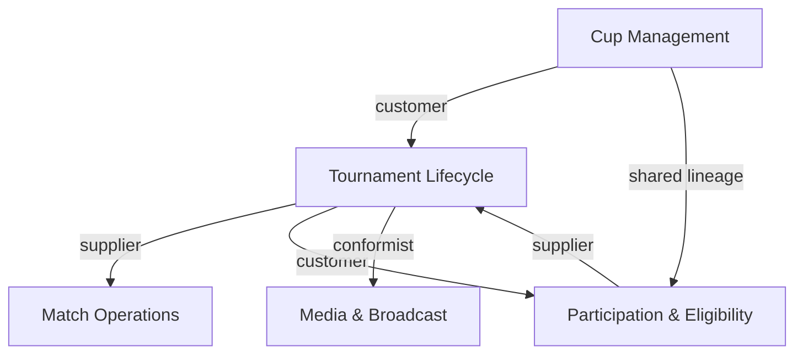
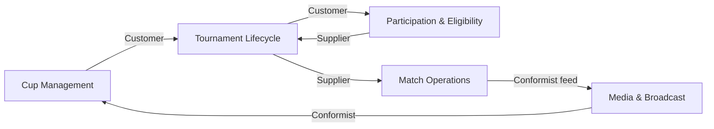

# Feature Specification: Competition Lifecycle Domain Spec

**Feature Branch**: `001-competition-spec`  
**Created**: 2025-11-22  
**Status**: Draft  
**Input**: User description: "Na podstawie tego co wczytałeś. Zrób specyfikacje"

## User Scenarios & Testing *(mandatory)*

### User Story 1 - Cup-to-Tournament Orchestration Clarity (Priority: P1)

As a space organizer, I need a single source of truth describing how cups spawn tournaments, which aggregates and services participate, and what dependencies or responsibilities I must cover before enabling a new competitive season.

**Why this priority**: Without this reference, organizers duplicate work, misconfigure stage settings, or trigger tournaments without required eligibility or participation data, directly risking customer-facing launches.

**Independent Test**: Present the specification to an organizer planning a fresh cup blueprint; they should complete a trial configuration review without consulting engineering.

**Acceptance Scenarios**:

1. **Given** an organizer planning a multi-stage cup, **When** they consult the spec, **Then** they can list required aggregates (`Cup`, `Tournament`, `CompetitionRestrictions`) and the GraphQL mutations that must be sequenced.
2. **Given** an organizer validating dependencies, **When** they look up relationship types, **Then** they can identify that Cup Management is the customer and Tournament Lifecycle is the supplier, along with downstream data consumers.

---

### User Story 2 - Match & Eligibility Sync Reference (Priority: P2)

As an operations lead, I need to understand how Match & Lobby APIs exchange status with Participation & Eligibility so I can troubleshoot queue behavior, lobby limits, and player confirmations without reverse engineering services.

**Why this priority**: Day-to-day operations hinge on resolving queue bottlenecks and eligibility mismatches quickly; lacking a clear spec slows incident recovery and increases support debt.

**Independent Test**: Provide the spec to an operations specialist facing a match confirmation escalation; they should resolve the flow by following the described dependencies and events.

**Acceptance Scenarios**:

1. **Given** a stuck matchmaking offer, **When** the specialist reviews the spec, **Then** they can trace events (`MatchmakingQueueUpdated`, `TournamentParticipationUpdate`) and determine which bounded context owns the next action.
2. **Given** confusion about allowed tournament actions, **When** the specialist examines cross-domain components, **Then** they can describe how `AllowedTournamentAction` is exposed through Participation APIs and consumed by match UIs.

---

---

### Edge Cases

- When a tournament is created outside a cup blueprint, the spec must still outline how Tournament Lifecycle backfills required Cup dependencies or flags unsupported flows.
- When matchmaking queues serve both standalone matches and tournament brackets, the specification must state how ownership and SLA differ so operations can pick the correct escalation path.
- When broadcast consumers lack `CompetitionContext`, the document must specify how to derive or request it to avoid misaligned overlays.
- When `gameAccountId` formats diverge per game, the spec must note validation responsibility and the risks of treating them as raw strings.

## Requirements *(mandatory)*

### Functional Requirements

- **FR-001**: The specification MUST describe each domain (Cup Orchestration, Tournament Lifecycle, Match Operations & Lobby Control, Participation & Eligibility, Media & Broadcast) including purpose, scope, and bounded contexts.
- **FR-002**: For every bounded context, the spec MUST enumerate aggregates, entities, value objects, domain events, services, and repositories referenced in the source material.
- **FR-003**: The document MUST list available GraphQL operations (queries, mutations, subscriptions) and explain which roles or systems invoke them.
- **FR-004**: Dependencies between contexts MUST be stated with relationship types (e.g., customer-supplier, partnership, conformist, ACL) and directional data flows.
- **FR-005**: The spec MUST articulate roles/responsibilities (organizer, queue runner, BOT, media lead, etc.) and the decisions they own.
- **FR-006**: It MUST include both textual and Mermaid context maps to visualize cross-context interactions for stakeholders who consume either format.
- **FR-007**: Cross-domain components (e.g., `CompetitionContext`, `AllowedTournamentAction`, `GameSession`, `LobbyInformation`) MUST be documented with ownership expectations and integration touchpoints.
- **FR-008**: Notes about missing contexts, shared matchmaking queues, implicit rooms, and weak value-object validation MUST be captured so follow-up work can be prioritized.
- **FR-009**: Refactoring suggestions, including potential extraction of a Lobby Service and replacing primitive identifiers with value objects, MUST be explicitly stated with rationale.
- **FR-010**: The specification MUST remain implementation-agnostic while enabling testing by referencing observable behaviors, events, and user-facing outcomes.

### Key Entities *(include if feature involves data)*

- **Cup**: Aggregate encapsulating `CupSettings`, stage blueprints, and lifecycle mutations (`create`, `edit`, `start`, `cancel`); acts as the entry point for competitions.
- **Tournament**: Aggregate governing `TournamentSettingsGroup`, stages, brackets, match series, and associated repositories for retrieval and signup flows.
- **Match / MatchSeries**: Aggregates modeling lobby composition, matchmaking queues/offers, match results, and lifecycle timers that gate game sessions.
- **Participation Objects**: `OwnTournamentParticipation`, `OwnEligibility`, `TournamentLineupMember`, and related restrictions controlling who may join, confirm, or leave events.
- **Broadcast**: Aggregate representing public-facing streams, embeds, and images tied to tournaments via conformist relationships.
- **CompetitionContext**: Single identifier minted when a Cup blueprint is approved and reused by all descendant tournaments, matches, and broadcasts so every artifact references the same competition lineage.
- **AllowedTournamentAction & LobbyInformation**: Shared value objects exposing permissible actions to clients and describing lobby state (`maximumLobbyMinutes`, `gameSessionTag`, etc.).

## Cup & Tournament Aggregate Reference

| Aggregate | Purpose | GraphQL / REST touchpoints | Primary Roles | Supplier Relationships |
|-----------|---------|----------------------------|---------------|------------------------|
| `CupHostView` | Blueprint readiness, dependency health, and attendance rollups. | `Mutation::createCup`, `Mutation::editCup`, `Mutation::startCup`, REST `/v1/hosts/{hostId}/cups/{cupId}` (GET/PATCH). | Organizer (blueprint owner), Cup Support (dependency auditor). | Customer of Tournament Lifecycle, Participation Eligibility, Match Lifecycle. |
| `TournamentHostView` | Lineup readiness, seeding windows, match gates inherited from Cup. | `Mutation::setTournamentPreSeed`, `Mutation::confirmTournamentParticipation`, REST `/v1/hosts/{hostId}/tournaments/{tournamentId}` (GET/PATCH). | Organizer (approves seeds), Lineup Captain (confirms roster), Queue Runner (monitors gates). | Supplier of Match Operations; customer of Participation Eligibility. |

- **Operational Checklist**
  1. Organizer inspects Cup stage statuses before `startCup`, ensuring every supplier context reports `state=green`. Manual waivers flow through the PATCH endpoint’s `dependencyOverrides`.
  2. Tournament sheet watches `settingsHash` drift so editors can reconcile blueprint vs. per-tournament overrides.
  3. Lineup confirmations stay in sync with Participation events — `lineupStatus.allowedActions` is mirrored from Participation overlays and must match UI affordances before brackets publish.

- **Mermaid Context Map**

- **Testing Hooks**
  - `curl /v1/hosts/{hostId}/cups/{cupId}` returns `competitionContextId`, stage statuses, supplier states, and attendance rollups before Cup launch rehearsals.
  - `curl -X PATCH /v1/hosts/{hostId}/tournaments/{tournamentId}` with `lineupDirectives` flips `lineupStatus.confirmed` and emits `TournamentParticipationUpdate` over SSE in under 2 seconds.
  - SSE subscription `/v1/hosts/{hostId}/streams/cup/{cupId}` replays the most recent Cup snapshot using leased `host_subscriptions` rows so hosts can recover after reconnects.

## Host Experience: Cup & Tournament Configuration

### Host-Facing Surfaces

- **Cup Command Center** (Cup Management UI): Surfaces blueprint status, pending mutations (`createCup`, `editCup`, `startCup`, `cancelCup`), and Attendance rollups (`OwnCupParticipation`, `Attendance` aggregate).
- **Tournament Sheet** (Tournament Lifecycle UI): Lists spawned tournaments, per-stage overrides, seed configs, and eligibility warnings sourced from `TournamentRestrictions`.
- **Participation Monitor**: Mirrors Participation & Eligibility data so hosts see who joined or confirmed, with `AllowedTournamentAction` badges to highlight blockers.
- **Match Console**: Read-only snapshot of Match & Lobby state (`MatchmakingQueue`, `LobbyInformation`) showing which lineups progressed or are stuck.

These surfaces consume the GraphQL operations enumerated in `co_brakuje.md`, tying host expectations to concrete APIs.

### Attendance Lifecycle (Host View)

1. **Join/Signup Event**: Player actions against `Mutation::joinCup` or `Mutation::signupTournament` emit `OwnCupParticipation` / `OwnTournamentParticipation`. Attendance counters update in Cup Command Center.
2. **Eligibility Evaluation**: `CompetitionRestriction` and `OwnEligibility` validate participation. Failures surface as inline banners plus `AllowedTournamentAction` denying confirmation.
3. **Confirmation Stage**: `Mutation::confirmTournamentParticipation` toggles status; hosts view confirmed/unconfirmed ratios per stage and can ping captains.
4. **Propagation to Match**: Confirmed participants flow into `MatchmakingQueue`. Host sees queue health in Match Console and can pause or resume Cup progression if attendance drops.

### Cup Configuration Flow (Host)

- **Blueprint Intake**: Host selects `CupSettings` template (phases, formats, schedule). `CompetitionContext` is reserved upon save so downstream artifacts share lineage.
- **Stage & Dependency Checklist**: For each `CupTournamentStageSettings`, host defines required tournaments, dependencies, and supplier contexts (e.g., Tournament Lifecycle readiness) satisfying FR-004.
- **Validation Hooks**: Before `startCup`, system checks Attendance targets, template completeness, and downstream readiness. Errors cite retry mutations (`editCup`, `startCup`).
- **Launch & Monitoring**: When `startCup` succeeds, host dashboard shows generated tournaments with quick links to configure seeding or override times; anomalies reference `StartCupResponse` payloads.

### Tournament Configuration Flow (Host)

- **Spawn or Manual Create**: Tournaments arrive via Cup blueprint or direct creation. Host can override inherited `TournamentSettingsGroup` before publishing.
- **Seeding & Lineups**: Host (or lineup captain) uses `Mutation::setTournamentPreSeed`, `TournamentLineupPlacement` to define brackets. Roles are explicit: host approves bracket, captain confirms lineup.
- **Restrictions & Allowed Actions**: Host reviews `TournamentRestrictions` and `AllowedTournamentAction` for each lineup to ensure clients see the same options (join, confirm, withdraw).
- **Handoff to Match**: When tournament state is `READY`, API pushes `TournamentLineup` into Match queues. Host monitors readiness and can halt progression by toggling tournament status or invoking `cancelCup`.

### Match Snapshot for Hosts

- Hosts see each match’s `LobbyInformation` (`maximumLobbyMinutes`, `maximumGoToGameMinutes`, `gameSessionTag`, `GameSession`). This answers “jak wygląda match” at orchestration level without recreating Match UI.
- `MatchmakingQueueUpdated` events highlight stalled offers; host cross-references Attendance to identify the player or lineup blocking progression.
- `TournamentParticipationUpdate` events feed Participation Monitor, keeping host informed when matches progress or require manual intervention.

### Operations Troubleshooting Notes

- When queue offers stall, operators subscribe to `/v1/hosts/{hostId}/streams/tournament/{tournamentId}` to watch `MatchmakingQueueUpdated` payloads emitted by the Host Streaming service. The payload includes the owning bounded context so escalation is clear.
- Allowed actions drift is resolved by comparing the `lineupStatus.allowedActions` field (coming from Participation overlays) with what the UI currently exposes; discrepancies indicate stale clients.
- Attendance anomalies are triaged by comparing `/attendance/{scopeType}/{scopeId}` totals with Cup/Tournament dashboards—if totals lag by more than one event, resync via the Attendance snapshot endpoint before escalating.

## Match & Eligibility Troubleshooting Reference

1. **Escalation Map**
   - `MatchmakingQueueUpdated` → owned by Match Operations; if payload shows `queueState.status=BLOCKED`, open an incident with Match Lifecycle.
   - `TournamentParticipationUpdate` → owned by Participation & Eligibility; if payload lacks expected lineup, confirm Participation stream health before paging Match Ops.
2. **Allowed Action Exposure**
   - `lineupStatus.allowedActions` is hydrated from Participation overlays via `ApplyAllowedActionOverrides`. Hosts compare that array with Badge UI to detect stale clients.
   - Overrides submitted through the Tournament PATCH endpoint force-add/remove specific actions for remediation windows; every override is auditable via the Host Streaming logs.
3. **Troubleshooting Checklist**
   - **Stuck Offer**: Pull latest `match_lobby_views` row, confirm `queueState.offerId`, then replay SSE events using `Last-Event-ID` to ensure no frames were missed.
   - **Eligibility Mismatch**: Call `/v1/hosts/{hostId}/tournaments/{tournamentId}` and cross-check `lineupStatus.confirmed` vs. Participation Monitor data; if divergence exists, resync `attendance_snapshots`.
   - **Lobby Timeout**: Inspect `LobbyInformation.maximumGoToGameMinutes`; if the value is below policy, flag the Cup blueprint template for remediation and consider Lobby Service extraction (see Refactoring Notes).

## Cross-Domain Components & Ownership

| Component | Owner | Responsibilities | Integration Touchpoints |
|-----------|-------|------------------|-------------------------|
| `CompetitionContext` | Cup Management | Mint lineage IDs, persist on Cup approval, propagate downstream. | Stored in `cup_host_views`, reused by Tournament + Match payloads, logged in SSE events for traceability. |
| `AllowedTournamentAction` | Participation & Eligibility | Determine per-lineup capability set, expose overlay feed. | Host Streaming applies overrides + merges overlay JSON before serving Tournament views. |
| `LobbyInformation` | Match Operations | Capture lobby timers, `gameSessionTag`, `maximumLobbyMinutes`. | Stored in `match_lobby_views`, surfaced through `/tournaments/{tournamentId}/matches` endpoint. |
| `GameSession` | Match Operations | Durable session identifier feeding broadcast overlays. | Propagated through SSE to Media & Broadcast so overlays lock onto the right session. |

Each shared component lists an escalation owner so organizers know whether to page Tournament Lifecycle, Participation, or Match Ops when discrepancies appear in Host Streaming responses.

## Context Map & Refactoring Notes

- **Edge Case Tracking**
  - Standalone tournaments still run through Tournament Lifecycle but store a `cup_id=NULL`; Host Streaming flags these rows so Cup dashboards highlight missing lineage.
  - Shared matchmaking queues require SLA labels — tournaments borrowing a standalone queue inherit the queue owner’s escalation window, preventing duplicate incidents.
  - Broadcast consumers missing `CompetitionContext` request it via Host Streaming GET endpoints; the response includes lineage IDs even when upstream GraphQL omitted them.
  - Every identifier persisted in projections is being upgraded from primitive strings to value objects (e.g., `GameAccountId`, `CompetitionContextId`) to prevent invalid formats from entering SSE payloads.
- **Refactoring Suggestions**
  - Extract a **Lobby Service** that owns `LobbyInformation` validation and timeout policies; Host Streaming would subscribe to it instead of duplicating rules inside match projections.
  - Replace primitive supplier identifiers with dedicated value objects backed by shared libraries so dependency health arrays cannot contain typos (mitigates FR-009).
  - Expand `host_subscriptions` with a lightweight lease garbage collector (already scaffolded) to support millions of SSE cursors without manual cleanup.

## Assumptions

- HTTP, domain models, and role definitions referenced in the source document remain authoritative for this specification cycle.
- Stakeholders consume the documentation via `docs-site` with access to both Markdown and Mermaid renderings.
- No additional bounded contexts (e.g., template libraries) are productized during this cycle; gaps noted in the spec represent the current scope limits.

## Clarifications

### Session 2025-11-22

- Q: What scope should `CompetitionContext` IDs cover so tournaments, matches, and broadcasts stay aligned? → A: Mint one `CompetitionContext` per Cup approval and reuse it across downstream tournaments, matches, and broadcasts.

## Success Criteria *(mandatory)*

### Measurable Outcomes

- **SC-001**: During architecture review, every bounded context checklist item (purpose, model, operations, dependencies, roles) is marked complete with zero omissions.
- **SC-002**: At least 80% of organizers and operations leads surveyed after reading the spec can accurately describe upstream/downstream dependencies without escalation.
- **SC-003**: The document catalogs a minimum of three cross-domain components and three refactoring opportunities, each traceable to a stated pain point.
- **SC-004**: In onboarding simulations, stakeholders complete the Cup-to-Tournament planning exercise in under 30 minutes using only the spec as guidance.
- **SC-005**: Incident reviews referencing match/eligibility flows identify the spec as sufficient for root-cause tracing, reducing clarification requests to fewer than two per release cycle.
