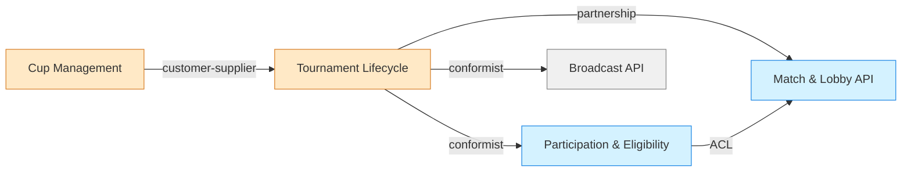

- # Domain: Competition Lifecycle
**Type:** Core  
**Description:** Obsługuje pełny cykl życia wydarzeń (cup → turniej → mecze), w tym konfigurację formatów, harmonogramów oraz operacje organizatora.

---

## Subdomain: Cup Orchestration
Opis: definiowanie i uruchamianie cupów, które generują turnieje zgodnie z dostarczonym blueprintem.

### Bounded Context: Cup Management API
**Purpose:**  
Zapewnienie mutacji GraphQL do tworzenia, edycji, startu i anulowania cupów, wraz z konfiguracją etapów i ograniczeń.

**Domain Model:**  
- Aggregates: `Cup` (zagnieżdżone `CupSettings`, `CompetitionStageSettings`)  
- Entities: `OwnCupParticipation`, `Attendance`, `CompetitionRestrictions`  
- Value Objects: `Schedule`, `Links`  
- Domain Events: `StartCupResponse`, `CancelCupResponse`  
- Services: `Mutation::createCup`, `editCup`, `startCup`, `cancelCup`  
- Repositories: `Query::cup`, `Query::searchCups`

**Models Used (z API/Schema):**  
- `Cup`, `CupSettings`, `CupTournamentStageSettings`, `OwnCupParticipation`

**Operations / Endpoints:**  
- `Mutation::createCup`, `editCup`, `startCup`, `cancelCup`  
- `Query::cup`, `searchCups`, `cupsForGame` (legacy)

**Roles / Odpowiedzialności:**  
- Organizator Space / BOT (tworzy i zarządza cyklem cupa)  
- Space Admin (utrzymuje szablony i konfiguracje)

**Dependencies:**  
- depends on: `Tournament Lifecycle` (wygenerowanie faktycznych turniejów)  
- provides data to: `Participation & Eligibility` (dostarcza listę dostępnych wydarzeń)  
- relationship type: customer-supplier (Cup → Tournament), partnership (Cup ↔ Eligibility)

---

## Subdomain: Tournament Lifecycle
Opis: zarządza strukturą turnieju, etapami, harmonogramami i konfiguracją meczów.

### Bounded Context: Tournament Lifecycle API
**Purpose:**  
Obsługa powstania turnieju (z cupa lub niezależnie), zarządzanie bracketami, ustawieniami gry i ograniczeniami.

**Domain Model:**  
- Aggregates: `Tournament` (z `TournamentSettingsGroup`, `TournamentStages`)  
- Entities: `TournamentStage`, `TournamentBracket`, `MatchSeries`, `TournamentLineup`  
- Value Objects: `TournamentSchedule`, `TournamentLinks`, `TournamentLineupPlacement`  
- Domain Events: `StartCupResponse` (spin-off), `TournamentParticipationUpdate`  
- Services: `Mutation::signupTournament`, `leaveTournament`, `confirmTournamentParticipation`, `setTournamentPreSeed`  
- Repositories: `Query::tournament`, `tournamentsForSpace`

**Models Used:**  
- `Tournament`, `TournamentStage` (+implementacje), `TournamentSettingsGroup`, `TournamentSignup`, `TournamentRoster`

**Operations / Endpoints:**  
- `Query::tournament`, `tournamentsForSpace`  
- `Mutation::signupTournament`, `leaveTournament`, `confirmTournamentParticipation`, `setTournamentPreSeed`

**Roles / Odpowiedzialności:**  
- Organizator turnieju  
- Kapitan linii (zarządza seedami, potwierdza udział)  
- BOT/worker (automatyzuje seedowanie i aktywacje)

**Dependencies:**  
- depends on: `Cup Management API` (gdy turniej powstał z cupa)  
- provides data to: `Match & Lobby API` (tworzenie faktycznych meczów)  
- relationship type: customer-supplier (Tournament → Match), shared-kernel (harmonogram + restrykcje)

---

# Domain: Match Operations & Lobby Control
**Type:** Supporting  
**Description:** Zarządza meczami, matchmakingiem, ofertami i lobby (“pokoje”).

## Subdomain: Real-time Match & Lobby Management

### Bounded Context: Match & Lobby API
**Purpose:**  
Modeluje mecze pojedyncze i serie (`Match`, `MatchSeries`) wraz z lobby, limitami czasu i powiązaniami z sesjami gier.

**Domain Model:**  
- Aggregates: `Match` (z `MatchLineup`, `MatchResults`), `MatchSeries`  
- Entities: `MatchLineup`, `MatchMember`, `GameSession`, `MatchmakingQueue`, `MatchmakingOffer`  
- Value Objects: `GameSessionTag`, `LobbyInformation`, `MatchResult`, `MatchStatisticsCollection`  
- Domain Events: `MatchmakingQueueUpdated`, `TournamentParticipationUpdate`  
- Services: `Mutation::joinMatchmakingQueue`, `leaveMatchmakingQueue`, `acceptMatchmakingOffer`, `declineMatchmakingOffer`, `confirmMatchParticipation`  
- Repositories: `Query::match`, `matchSeries`, `matchmakingQueue`, `matchmakingQueuesForGame`

**Models Used:**  
- `Match`, `MatchSeries`, `MatchmakingQueue`, `MatchmakingOffer`, `GameSession`, `LobbyInformation`

**Operations / Endpoints:**  
- `Query::match`, `matchSeries`, `matchmakingQueue`, `matchmakingQueuesForGame`  
- `Mutation::joinMatchmakingQueue`, `leaveMatchmakingQueue`, `acceptMatchmakingOffer`, `declineMatchmakingOffer`, `confirmMatchParticipation`  
- `Subscription::matchmakingQueueUpdated`, `tournamentParticipationUpdated`

**Roles / Odpowiedzialności:**  
- Queue Runner / Matchmaker service  
- Zawodnik (akceptuje ofertę, potwierdza mecz)  
- BOT (obsługa kolejek)

**Dependencies:**  
- depends on: `Tournament Lifecycle` (kontekst turniejowy meczów)  
- provides data to: `Participation & Eligibility` (status meczów)  
- relationship type: partnership (Match ↔ Tournament), ACL (Match ↔ Participation)

Mechanika pokoju: kolejka matchmakingowa → `MatchmakingOffer` (OPEN/ACCEPTED/PLAYING) → utworzenie `Match` z polami `maximumLobbyMinutes`, `maximumGoToGameMinutes`, `gameSessionTag`, `gameSession` i `LobbyInformation`.

---

# Domain: Player Participation & Eligibility
**Type:** Supporting  
**Description:** Kontroluje kto i jak może uczestniczyć w cupach, turniejach i leaderboardach.

## Subdomain: Participation Management

### Bounded Context: Participation & Eligibility API
**Purpose:**  
Utrzymuje statusy zgłoszeń (`OwnTournamentParticipation`, `OwnCupParticipation`), restrykcje (`CompetitionRestriction`, `OwnEligibility`) oraz potwierdzenia udziału.

**Domain Model:**  
- Aggregates: `OwnTournamentParticipation`, `OwnEligibility`  
- Entities: `TournamentLineupMember`, `CompetitionRestriction`, `OwnMatchmakingQueueParticipation`  
- Value Objects: `TournamentLobbyFeedback`, `AllowedTournamentAction`, listy restrykcji  
- Domain Events: `TournamentParticipationUpdate`, `MatchmakingQueueUpdated`  
- Services: `Mutation::signupTournament`, `confirmTournamentParticipation`, `joinCup`, `joinLeaderboard`, `leaveLeaderboard`  
- Repositories: `Query::me`, `me.tournaments`, `ownTournamentEligibility`, `ownCupEligibility`

**Models Used:**  
- `OwnTournamentParticipation`, `OwnEligibility`, `TournamentLobbyFeedback`, `AllowedTournamentAction`

**Operations / Endpoints:**  
- `Query::me`, `me.tournaments`, `ownTournamentEligibility`, `ownCupEligibility`  
- `Mutation::signupTournament`, `confirmTournamentParticipation`, `leaveTournament`, `joinCup`, `joinLeaderboard`, `leaveLeaderboard`

**Roles / Odpowiedzialności:**  
- Gracz / lineup captain  
- Organizator (definiuje restrykcje i allowed actions)

**Dependencies:**  
- depends on: `Tournament Lifecycle` (kontekst turniejowy)  
- provides data to: `Match & Lobby API` (kto jest uprawniony do meczów)  
- relationship type: conformist (podąża za zasadami turnieju), ACL (ekspozycja allowed actions)

---

# Domain: Media & Broadcast
**Type:** Generic  
**Description:** Commodity – prezentacja danych (broadcasts, streamy, grafiki).

## Subdomain: Broadcast Publishing

### Bounded Context: Broadcast API
**Purpose:**  
Dostarczanie danych o transmisjach (`Broadcast`, `Stream`, `MatchSeriesStream`) dla UI i embedów.

**Domain Model:**  
- Aggregates: `Broadcast`  
- Entities: `Stream`, `MatchSeriesStream`, `Embed`, `Image`  
- Value Objects: `LogoSize`, `BannerSize`, `ThumbnailSize`  
- Domain Events: — (statyczne odczyty)  
- Services: `Query::broadcast`, `Tournament.links`  
- Repositories: `Query::space`, `Query::broadcast`

**Models Used:**  
- `Broadcast`, `Stream`, `Image`, `Embed`

**Operations / Endpoints:**  
- `Query::broadcast`, `space`, `Tournament.links`

**Roles / Odpowiedzialności:**  
- Viewer / UI  
- Organizer (dostarcza linki i grafiki)

**Dependencies:**  
- depends on: `Tournament Lifecycle` (ID turnieju i hosty)  
- provides data to: External web/app (Conformist)

---

# Context Map (tekstowa)
- Cup Management --(customer-supplier)--> Tournament Lifecycle  
- Tournament Lifecycle --(partnership)--> Match & Lobby API  
- Tournament Lifecycle --(conformist)--> Participation & Eligibility  
- Participation & Eligibility --(ACL)--> Match & Lobby API  
- Tournament Lifecycle --(conformist)--> Broadcast API

---

# Context Map (Mermaid)

---

# Cross-domain Components
- `CompetitionContext` współdzielony identyfikator, który pozwala BC rozumieć match/tournament.  
- `AllowedTournamentAction` wspólne API między Participation & Eligibility oraz Match & Lobby UI (określa dostępne akcje).  
- `GameSession` i `LobbyInformation` przenikają Match oraz Tournament, wskazując na potrzebę klarownego ownershipu.

---

# Notes
- Brak osobnego kontekstu do zarządzania szablonami turniejów – podejrzenie, że istnieje poza tym schematem.  
- Matchmaking queue jest wspólny dla turniejów i pojedynczych meczów, co utrudnia niezależny rozwój formatów.  
- Brak dedykowanego modelu “Room” – pokoje są implicit w `Match`. Może warto wyodrębnić agregat lobby.  
- `gameAccountId` jako plain `String` (per gra inny format) – rozważyć Value Object dla walidacji.

---

# Refactoring Suggestions
- Wydzielić osobny bounded context **Lobby Service** z agregatem `MatchLobby`, który enkapsuluje pola `maximumLobbyMinutes`, `maximumGoToGameMinutes`, `gameSession`, `LobbyInformation`. Ułatwi to niezależny lifecycle i ewentualny reconnect/spectator policy.  
- Zastąpić prymitywne `String`/`UUID` w newralgicznych miejscach (np. `GameAccountId`, `MatchId`) Value Objectami, by ograniczyć błędy integracji.  
- Rozważyć precyzyjniejsze rozdzielenie eventów (`TournamentParticipationUpdate` vs. `MatchmakingQueueUpdated`) tak, by konteksty nie musiały interpretować payloadów “nie dla nich”.

