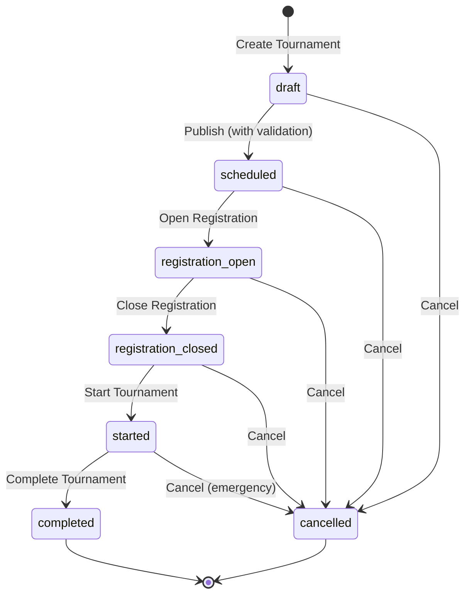

# Tournament Lifecycle

## Overview

This document describes the complete lifecycle of a tournament in the Winspire platform, including status transitions, business rules, and allowed actions.

## Status Flow



## Status Descriptions

### draft
**Description:** Tournament is being created/configured by the organizer.  
**Visibility:** Private - only visible to the organizer.  
**Registration:** Not available.  
**Purpose:** Initial setup phase where organizer configures all tournament details.

### scheduled
**Description:** Tournament is published and visible to players but registration is not yet open.  
**Visibility:** Public - visible to all users.  
**Registration:** Not available - players can see the tournament but cannot sign up yet.  
**Purpose:** Allows organizers to announce tournaments in advance before opening registration.

### registration_open
**Description:** Tournament registration is actively accepting participants.  
**Visibility:** Public.  
**Registration:** **Active** - players can join the tournament.  
**Purpose:** Primary registration phase where players sign up for the tournament.

### registration_closed
**Description:** Registration period has ended, tournament is preparing to start.  
**Visibility:** Public.  
**Registration:** Closed - no new registrations accepted.  
**Purpose:** Lock-in period before tournament begins, participants confirmed.

### started
**Description:** Tournament is currently in progress.  
**Visibility:** Public.  
**Registration:** Closed.  
**Purpose:** Active competition phase with ongoing matches.

### completed
**Description:** Tournament has finished successfully.  
**Visibility:** Public - results are visible.  
**Registration:** Closed.  
**Purpose:** Terminal state - tournament ended normally with results.

### cancelled
**Description:** Tournament was cancelled before or during execution.  
**Visibility:** Public (with cancelled badge).  
**Registration:** Closed.  
**Purpose:** Terminal state - tournament did not complete normally.

## Status Transitions

### Publish (draft → scheduled)

**Trigger:** Organizer clicks "Publish" button  
**Validation:**
- Tournament must be in `draft` status
- `scheduledStartTimeAt` must be set
- `scheduledStartTimeAt` must be in the future (> now)

**Side Effects:**
- Sets status to `scheduled`
- Sets default `format` if not provided:
  - type: `single_elimination`
  - teamSize: `1`
  - maxSlots: `250`
- Sets default `readyWindow`:
  - startsAt: current timestamp
  - endsAt: `scheduledStartTimeAt`
- Sets default `prize` if not provided:
  - type: `custom`
  - description: empty string

**Error Cases:**
- `scheduledStartTimeAt` not set → "Scheduled start time is required"
- `scheduledStartTimeAt` in past → "Cannot publish tournament with past start time"
- Status not `draft` → "Cannot transition from {currentStatus} to scheduled"

**API:**
```typescript
PUT /v1/:hostId/tournaments/:tournamentId
{ "status": "open", "format": {...}, "readyWindow": {...}, "prize": {...} }
```

### Open Registration (scheduled → registration_open)

**Trigger:** 
- Manual: Organizer clicks "Open Registration" button
- Automatic: AutoForceReady worker (future feature)

**Validation:**
- Tournament must be in `scheduled` status

**Side Effects:**
- Sets status to `registration_open`
- Players can now join the tournament

**Error Cases:**
- Status not `scheduled` → "Cannot transition from {currentStatus} to registration_open"

**API:**
```typescript
PUT /v1/:hostId/tournaments/:tournamentId
{ "status": "registration_open" }
```

### Close Registration (registration_open → registration_closed)

**Trigger:** 
- Manual: Organizer action (future feature)
- Automatic: Ready window expires or max capacity reached

**Validation:**
- Tournament must be in `registration_open` status

**Side Effects:**
- Sets status to `registration_closed`
- No new registrations accepted
- Existing participants locked in

### Start Tournament (registration_open/registration_closed → started)

**Trigger:** Organizer clicks "Start Tournament" button

**Validation:**
- Tournament must be in `registration_open` OR `registration_closed` status
- Minimum team count met (business rule - future)

**Side Effects:**
- Sets status to `started`
- Sets `actualStartTimeAt` to current timestamp
- Begins bracket/match generation

**Error Cases:**
- Status not `registration_open` or `registration_closed` → "Cannot transition from {currentStatus} to started"
- Insufficient participants → "Minimum team count not met" (future)

**API:**
```typescript
PUT /v1/:hostId/tournaments/:tournamentId
{ "status": "started" }
```

### Complete Tournament (started → completed)

**Trigger:** 
- Manual: Organizer marks as complete
- Automatic: All matches finished

**Validation:**
- Tournament must be in `started` status

**Side Effects:**
- Sets status to `completed`
- Sets `completedAt` to current timestamp
- Finalizes results and rankings

**API:**
```typescript
PUT /v1/:hostId/tournaments/:tournamentId
{ "status": "completed" }
```

### Cancel Tournament (any → cancelled)

**Trigger:** Organizer clicks "Cancel Tournament" button

**Validation:**
- Tournament must NOT be in `completed` status
- Can cancel from: `draft`, `scheduled`, `registration_open`, `registration_closed`, `started`

**Side Effects:**
- Sets status to `cancelled`
- Sets `cancelledAt` to current timestamp
- Notifies all participants (future)
- Refunds/compensations handled (future)

**Error Cases:**
- Status is `completed` → "Cannot cancel completed tournament"

**API:**
```typescript
PUT /v1/:hostId/tournaments/:tournamentId
{ "status": "cancelled" }
```

## Allowed Actions by Status

| Status | View | Edit | Publish | Open Reg | Start | Cancel | Join |
|--------|------|------|---------|----------|-------|--------|------|
| **draft** | Owner only | ✅ | ✅ | ❌ | ❌ | ✅ | ❌ |
| **scheduled** | Public | ✅ | ❌ | ✅ | ❌ | ✅ | ❌ |
| **registration_open** | Public | ⚠️ Limited | ❌ | ❌ | ✅ | ✅ | ✅ |
| **registration_closed** | Public | ❌ | ❌ | ❌ | ✅ | ✅ | ❌ |
| **started** | Public | ❌ | ❌ | ❌ | ❌ | ⚠️ Emergency | ❌ |
| **completed** | Public | ❌ | ❌ | ❌ | ❌ | ❌ | ❌ |
| **cancelled** | Public | ❌ | ❌ | ❌ | ❌ | ❌ | ❌ |

**Legend:**
- ✅ Allowed
- ❌ Not allowed
- ⚠️ Restricted (limited fields or emergency only)

## Business Rules

### Publication Rules
1. **Future Start Time Required:** Cannot publish a tournament with `scheduledStartTimeAt` in the past
2. **Start Time Mandatory:** `scheduledStartTimeAt` must be set before publishing
3. **Default Configuration:** System provides sensible defaults for format, ready window, and prize

### Registration Rules
1. **Scheduled First:** Registration can only be opened after tournament is published (scheduled)
2. **One-Way Lock:** Once registration opens, it cannot be reverted to scheduled
3. **Capacity Limits:** Registration auto-closes when `maxSlots` reached (future)
4. **Time Window:** Registration can be time-limited via `readyWindow` (future)

### Start Rules
1. **Registration Required:** Cannot start directly from `scheduled` status
2. **Minimum Participants:** Must meet `minimumTeamCount` to start (future enforcement)
3. **Point of No Return:** Starting tournament is irreversible (can only cancel or complete)

### Cancellation Rules
1. **No Cancel After Completion:** Completed tournaments cannot be cancelled
2. **Participant Notification:** All participants notified on cancellation (future)
3. **Emergency Cancel:** Can cancel even after tournament started (with warnings)

## Frontend UI Guidelines

### Status Badges
- **draft:** Grey/Zinc badge - "Szkic"
- **scheduled:** Cyan badge - "Zaplanowany"
- **registration_open:** Green/Emerald badge - "Otwarty"
- **registration_closed:** Orange badge - "Przed startem"
- **started:** Green/Emerald badge with pulse animation - "Aktywny"
- **completed:** Grey/Zinc badge - "Zakończony"
- **cancelled:** Red badge - "Anulowany"

### Action Buttons (Owner View)
- **Publish (Rocket Icon):** Visible in `draft` status, cyan color
- **Open Registration (Clipboard Icon):** Visible in `scheduled` status, green color
- **Edit (Pencil Icon):** Visible in `draft` and `scheduled` status
- **Start (Play Icon):** Visible in `registration_open` and `registration_closed` status, green color
- **Cancel (X Icon):** Visible in all except `completed` and `cancelled`, red color

### Confirmation Dialogs
All state transitions require user confirmation with:
- Clear title indicating the action
- Description of consequences
- Cancel and Confirm buttons
- Loading state during API call
- Error display if transition fails

## AutoForceReady (Future Feature)

**Purpose:** Automatically transition tournaments through status flow based on time and conditions.

**Planned Behavior:**
- Auto-open registration at specified time
- Auto-close registration when ready window expires
- Auto-start tournament when conditions met

**Configuration:** Per-tournament `autoForceReady` boolean flag.

## Related Documentation
- [Tournament API Specification](../tournament-api.openapi.yaml)
- [Competition Domain Context](../co_brakuje.md#subdomain-tournament-lifecycle)


